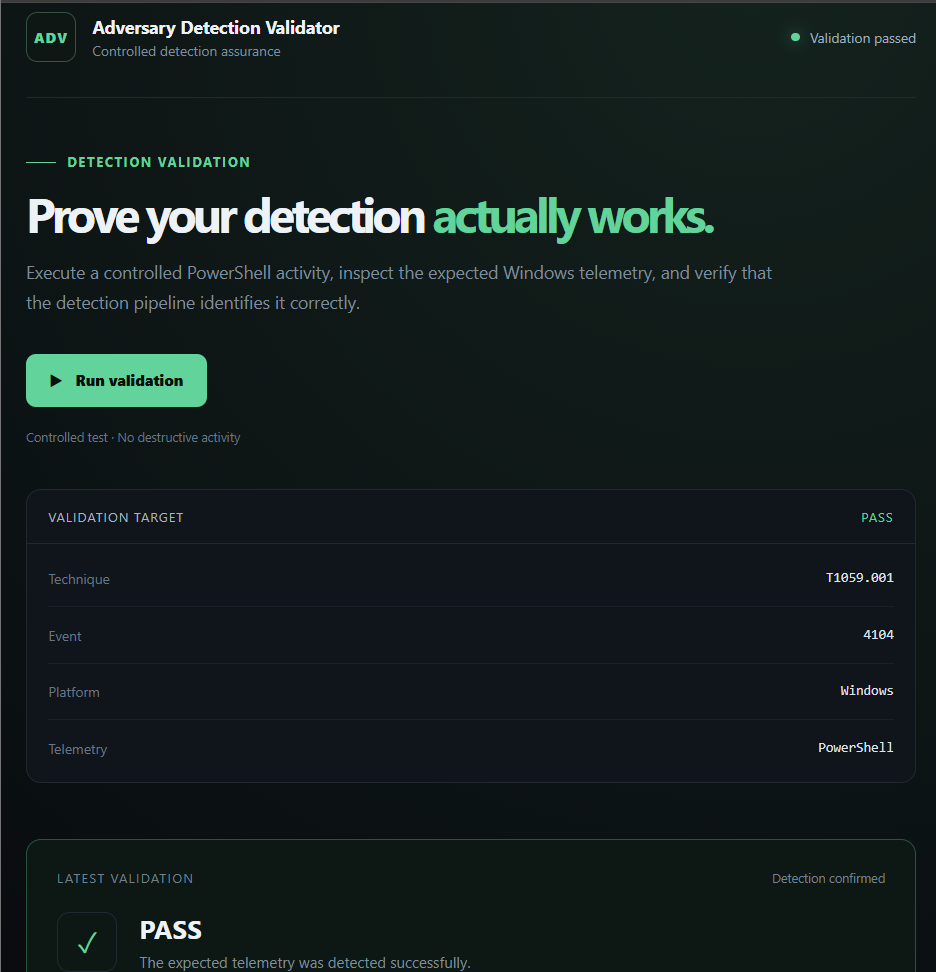

# Adversary Detection Validator

A Windows-focused cybersecurity project that validates whether controlled PowerShell activity generates the expected defensive telemetry.

The application executes a harmless PowerShell marker mapped to **MITRE ATT&CK T1059.001 (PowerShell)**, searches Windows PowerShell logs for the corresponding **Event ID 4104**, and produces an evidence-based **PASS/FAIL** result.

A Flask dashboard provides validation history, statistics, evidence, and report export.

## Features

- Validates MITRE ATT&CK technique **T1059.001 – PowerShell**
- Executes a safe and controlled PowerShell test
- Verifies **Windows Event ID 4104 – Script Block Logging**
- Uses a unique run identifier to correlate generated activity with telemetry
- Prevents false PASS results caused by older matching events
- Performs environment and telemetry preflight checks
- Polls for telemetry within a bounded time window
- Produces clear PASS/FAIL validation results
- Stores validation history and evidence
- Provides a Flask-based web dashboard
- Displays pass rate and recent validation activity
- Supports CSV export and JSON report download
- Includes automated unit and API tests

## How It Works

```text
Controlled PowerShell Test
          |
          v
Unique Correlation ID Generated
          |
          v
PowerShell Script Block Logging
          |
          v
Windows Event ID 4104
          |
          v
Telemetry Search + Correlation
          |
          v
     PASS / FAIL
          |
          v
Report + History + Dashboard
```

The controlled test executes `Write-Output` with the marker:

```text
ADV_DETECTION_VALIDATOR_T1059_001
```

A unique identifier is added for every validation run.

The validator searches:

```text
Microsoft-Windows-PowerShell/Operational
```

for Event ID **4104** containing both the marker and the unique identifier.

This ensures that a validation passes only when telemetry generated by the **current validation run** is found, rather than an older matching event.

## Dashboard



The dashboard provides:

- Latest validation result
- PASS/FAIL status
- Validation history
- Pass-rate statistics
- Recent activity
- Validation evidence
- CSV export
- JSON report download
- History clearing

## Safety

The validation activity is intentionally harmless.

It does **not** modify:

- Files
- Registry settings
- Services
- User accounts
- Network configuration

It only generates controlled PowerShell activity so that the corresponding defensive telemetry can be verified.

## Technology Stack

- **Python**
- **PowerShell**
- **Flask**
- **Windows Event Logs**
- **MITRE ATT&CK**
- **HTML / CSS / JavaScript**
- **Pytest**

## Prerequisites

- Windows
- Python 3.10+
- Windows PowerShell (`powershell.exe`)
- Permission to read the PowerShell Operational event log
- PowerShell Script Block Logging enabled

Script Block Logging can be configured through:

```text
Computer Configuration
> Administrative Templates
> Windows Components
> Windows PowerShell
> Turn on PowerShell Script Block Logging
```

If the required telemetry is unavailable or does not arrive within the validation window, the application records a **FAIL** rather than incorrectly producing a successful validation.

## Installation

Clone the repository and enter the project directory:

```powershell
git clone <repository-url>
cd adversary-detection-validator
```

Create a virtual environment:

```powershell
py -m venv .venv
```

Activate it:

```powershell
.\.venv\Scripts\Activate.ps1
```

Install the dependencies:

```powershell
python -m pip install --upgrade pip
pip install -r requirements.txt
```

## Running the Validator

Run the command-line validation:

```powershell
python src\main.py
```

A successful validation produces:

```text
RESULT: PASS
```

## Running the Dashboard

Start the Flask application:

```powershell
python -m flask --app web.app run --no-reload
```

Then open:

```text
http://127.0.0.1:5000
```

Click **Run validation** to perform a new detection validation.

## Testing

The project includes automated unit and API tests.

Run:

```powershell
python -m pytest
```

Current test suite:

```text
13 passed
```

The automated tests use mocks and do not execute real PowerShell activity or query Windows Event Logs.

## Project Structure

```text
adversary-detection-validator/
|
|-- src/
|   |-- atomic_runner.py
|   |-- main.py
|   |-- reporter.py
|   `-- validator.py
|
|-- web/
|   |-- app.py
|   `-- templates/
|       `-- index.html
|
|-- tests/
|   |-- test_app.py
|   `-- test_validator.py
|
|-- screenshots/
|   `-- dashboard.png
|
|-- reports/
|-- requirements.txt
|-- .gitignore
`-- README.md
```

## Detection Logic

A validation is considered successful only when:

1. The required Windows and PowerShell environment passes the preflight checks.
2. The controlled PowerShell activity executes successfully.
3. Event ID **4104** is generated.
4. The event contains the expected controlled marker.
5. The event contains the unique identifier belonging to the current validation run.

This correlation prevents unrelated or historical events from incorrectly satisfying the validation.

## Current Scope

The current implementation validates:

**MITRE ATT&CK T1059.001 – Command and Scripting Interpreter: PowerShell**

The architecture can be extended to support additional ATT&CK-aligned detection validation cases in the future.

## What This Project Demonstrates

This project demonstrates practical experience with:

- Detection engineering
- Adversary-emulation validation
- Windows security telemetry
- MITRE ATT&CK mapping
- Security automation
- Event correlation
- Defensive security testing
- Python backend development
- Automated testing